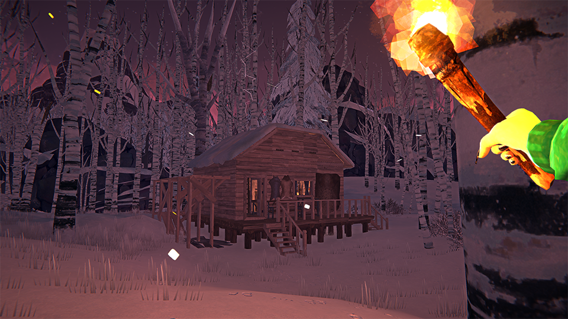

## Features:
- Modular base building system
- 2 building types: planks and logs (currently only differ in appearance)
- New building resources and means of gathering them
- Ghost structures to plan out buildings
- Scaffolding for easy height access
- Native UI integration
- UI Localization support. **Please don't create locaizations** until full release, there will be a lot of additions and changes

## Getting started:
- Collect a few planks. They can be crafted in bundles on furniture workbench or found in the world
- Collect a bunch of nails. They can be found in the world, in containers, when breaking down certain objects with prybar, or forged
- Hold B(can be changed) to bring up building menu, place things down
- Holding sprint key while looking at building parts can sow additional controls
- Building and breaking down can be done with many different tools, some are better for building, some - for dismantling

## Installation:
Unpack latest [release](https://github.com/HAHAYOUDEAD/Architect/releases) .zip into `.../Mods/`

Requires [ModSettings](https://github.com/DigitalzombieTLD/ModSettings), [ModData](https://github.com/dommrogers/ModData), [ModComponent](https://github.com/dommrogers/ModComponent) and PlacingAnywhere(easier to build with while snapping is not implemented, *not required*)

## Contributors:
[@Jods](https://github.com/Jods-Its), [@Marcy](https://github.com/DemonBunnyBon), [@Thekillergreece](https://github.com/Thekillergreece)
